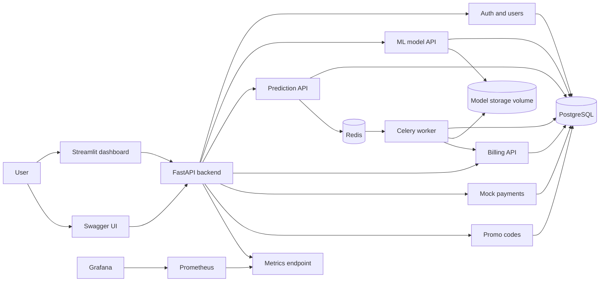
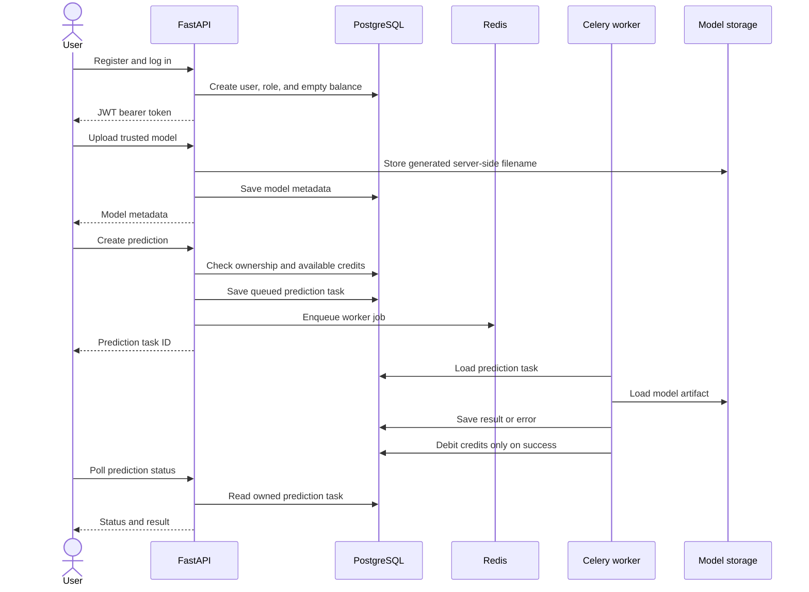
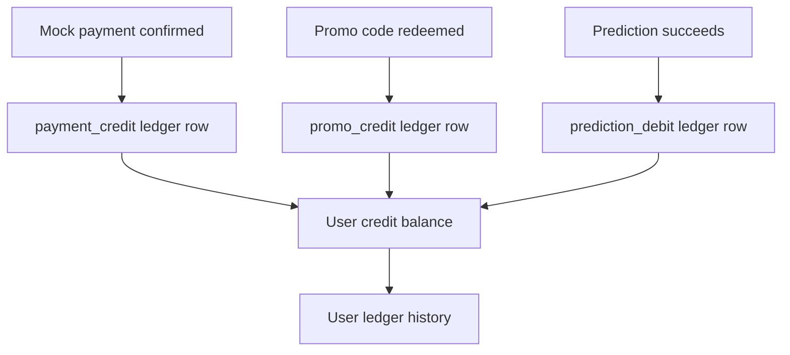

# Architecture

ML Prediction Service is a production-like educational MVP for authenticated
machine-learning predictions, credit billing, analytics, monitoring, and local
operations.

## Component Diagram

## Runtime Services

| Service | Responsibility |
| --- | --- |
| FastAPI backend | REST API, auth, model upload, prediction queueing, billing, payments, promo codes, metrics |
| PostgreSQL | Main relational database for users, models, predictions, billing, payments, and promo codes |
| Redis | Celery broker and result backend |
| Celery worker | Asynchronous model execution and successful-prediction billing |
| Streamlit dashboard | User-facing analytics view backed by the REST API |
| Prometheus | Scrapes backend metrics |
| Grafana | Displays the provisioned monitoring dashboard |

## Backend Modules

| Package | Responsibility |
| --- | --- |
| `app.api` | Versioned router and health contracts |
| `app.auth` | JWT creation, token validation, password checks, and auth dependencies |
| `app.users` | User creation, lookup, role assignment, and profile updates |
| `app.ml` | Model upload, artifact validation, metadata, and storage helpers |
| `app.predictions` | Prediction task API, input validation, worker execution service, Celery task |
| `app.billing` | Credit balance reads, immutable ledger rows, credit/debit operations |
| `app.payments` | Mock payment lifecycle and idempotent confirmation |
| `app.promo_codes` | Admin promo code management and one-time user redemption |
| `app.dashboard` | Streamlit dashboard and aggregation helpers |
| `app.monitoring` | Prometheus-compatible metrics generation |
| `app.db` | SQLAlchemy base, models, and session dependency |
| `app.core` | Settings, security validation, errors, and Celery app configuration |

## Main User Flow

## Billing Flow

All balance changes are written through service functions that update
`credit_balances` and insert a `billing_transactions` row in one database
transaction. Idempotency keys protect retryable flows from double crediting or
double debiting.

## Ownership And Security Boundaries

- Users can list and fetch only their own models, predictions, payments,
  billing transactions, and promo redemptions.
- Admin-only routes use the `admin` role dependency.
- Non-local environments fail startup with placeholder JWT secrets, debug mode,
  unsupported JWT algorithms, or invalid critical numeric settings.
- Public model responses include metadata, but not internal storage paths.
- Model artifacts are trusted inputs in this MVP; production hardening would
  require sandboxed execution or a safer model format.

## Deployment Shape

The MVP is designed for local Docker Compose:

- `backend` publishes FastAPI on host port `18000`;
- `dashboard` publishes Streamlit on host port `18501`;
- `prometheus` publishes Prometheus on host port `19090`;
- `grafana` publishes Grafana on host port `13000`;
- PostgreSQL, Redis, and model storage use local Docker volumes.

Real deployment would add managed secrets, private networking for metrics,
HTTPS, rate limiting, provider-backed payments, and isolated model execution.
