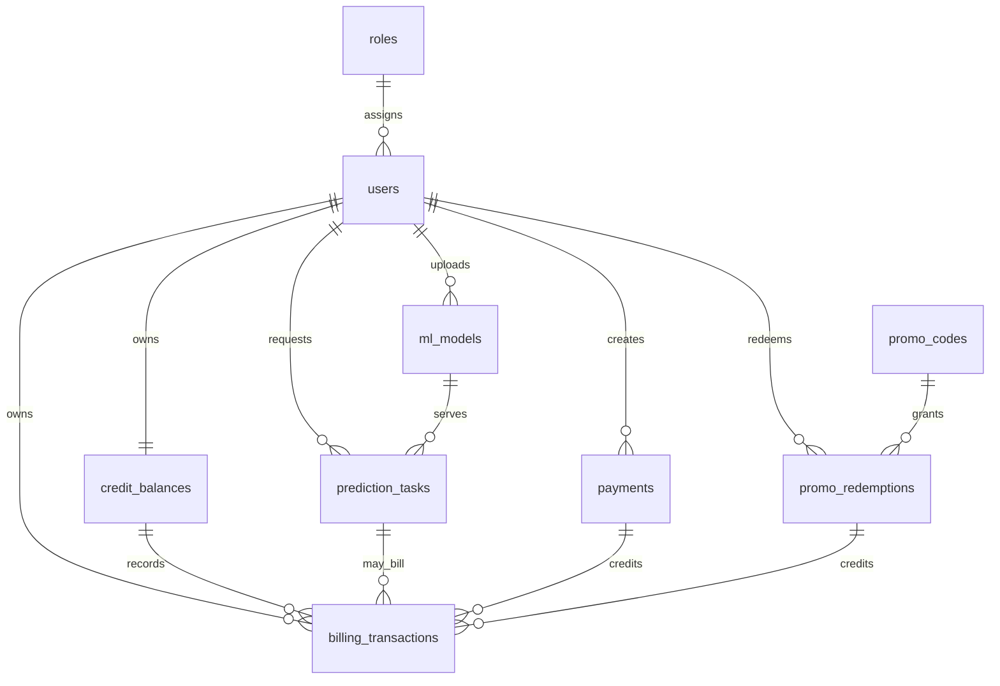

# Database Design

Step 3 defines the first PostgreSQL schema for ML Prediction Service. It is a
schema and migration stage only; API handlers and business workflows are added
in later stages.

## Owner Decisions

The simplest agreed options are used for the MVP:

- promo codes grant fixed credits into the user's single common balance;
- one successful prediction costs `1` credit by default;
- mock payment records store purchased credits directly, without a separate
  credit package catalog in this step.

All credits are stored as integers. Money-like payment amounts are stored in
minor currency units with `amount_cents`, avoiding floating point arithmetic.

## Main Tables

| Table | Purpose |
| --- | --- |
| `roles` | `user` and `admin` role records |
| `users` | Registered users and auth identity data |
| `credit_balances` | One common credit balance per user |
| `ml_models` | Uploaded Scikit-learn model metadata and storage path |
| `prediction_tasks` | Asynchronous prediction requests and results |
| `billing_transactions` | Immutable credit ledger rows |
| `payments` | Mock/sandbox payment records |
| `promo_codes` | Fixed-credit promo codes |
| `promo_redemptions` | User promo activations with anti-repeat constraint |

## ERD



## Indexes And Constraints

- `users.email` is unique and indexed.
- `credit_balances.user_id` is unique, enforcing one common balance per user.
- `prediction_tasks` is indexed by user/status and model/status for dashboards
  and status polling.
- `billing_transactions` is indexed by user, type, status, and source object.
- `promo_redemptions` has a unique `(user_id, promo_code_id)` constraint to
  prevent repeated activation by the same user.
- Credit amounts and balances use non-negative or positive check constraints.

## Billing Transaction Strategy

Billing will update `credit_balances` and insert a `billing_transactions` row in
one database transaction. The billing stage should lock the user's balance row
before changing it, then write the ledger row with the resulting
`balance_after_credits`.

For the MVP, failed predictions do not debit credits. A successful prediction
creates a `prediction_debit` transaction for the fixed configured price.
Successful mock payments create `payment_credit` transactions. Promo activation
creates one `promo_redemption` row and one `promo_credit` transaction in the
same transaction.

`billing_transactions.idempotency_key` is unique so later API/worker flows can
retry payment, promo, or prediction finalization safely.

## Migrations

Alembic owns schema changes. The initial revision is:

```text
202608250001_initial_database_schema
```

Common commands:

```powershell
alembic upgrade head
alembic revision --autogenerate -m "describe change"
```

New schema changes should be made in SQLAlchemy models first, then generated as
Alembic revisions and reviewed before commit.
