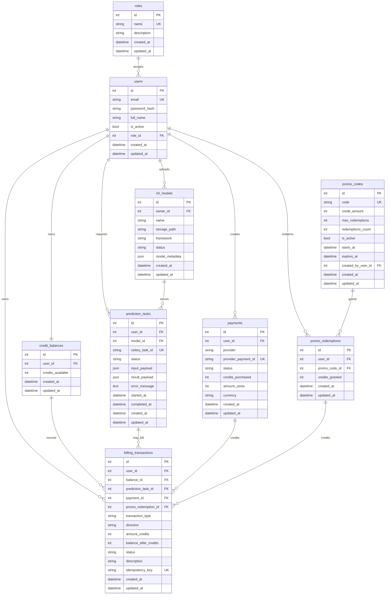

# Entity Relationship Diagram

This ERD documents the implemented MVP database schema.

## Diagram

## Table Ownership

| Table | Primary owner |
| --- | --- |
| `roles` | System |
| `users` | Auth/user domain |
| `credit_balances` | Billing domain |
| `ml_models` | ML domain, owned by a user |
| `prediction_tasks` | Prediction domain, owned by a user |
| `payments` | Payments domain, owned by a user |
| `promo_codes` | Promo domain, admin-managed |
| `promo_redemptions` | Promo domain, owned by a user |
| `billing_transactions` | Billing ledger, owned by a user and linked to source operations |

## Key Constraints

- `users.email` is unique.
- `roles.name` is unique.
- `credit_balances.user_id` is unique, enforcing one common balance per user.
- `payments.provider_payment_id` is unique.
- `prediction_tasks.celery_task_id` is unique when present.
- `promo_codes.code` is unique.
- `promo_redemptions` has a unique `(user_id, promo_code_id)` pair.
- `billing_transactions.idempotency_key` is unique when present.
- Credit amounts are positive, and resulting balances cannot be negative.

## Ledger Links

`billing_transactions` can point to the source operation that caused the balance
change:

| Transaction type | Direction | Source link |
| --- | --- | --- |
| `payment_credit` | `credit` | `payment_id` |
| `promo_credit` | `credit` | `promo_redemption_id` |
| `prediction_debit` | `debit` | `prediction_task_id` |
| `adjustment` | `credit` or `debit` | admin operation |

This keeps the user's current balance fast to read while preserving an auditable
history of balance changes.
